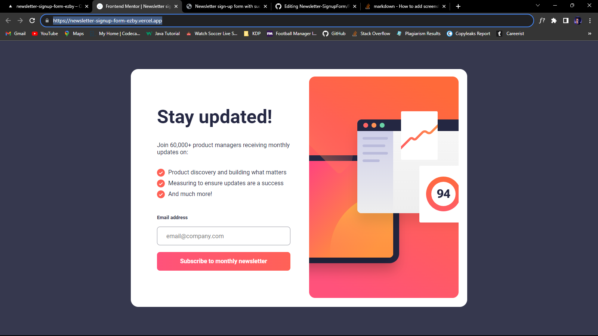
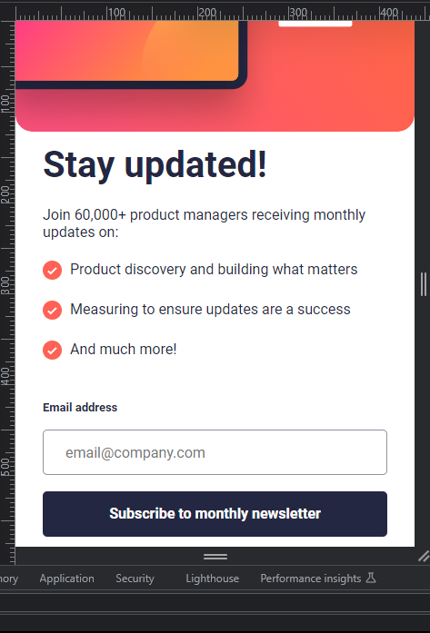

# Frontend Mentor - Newsletter sign-up form with success message solution

This is a solution to the [Newsletter sign-up form with success message challenge on Frontend Mentor](https://www.frontendmentor.io/challenges/newsletter-signup-form-with-success-message-3FC1AZbNrv). Frontend Mentor challenges help you improve your coding skills by building realistic projects.

## Table of contents

- [Overview](#overview)

  - [Screenshot](#screenshot)
  - [Links](#links)

- [My process](#my-process)
  - [Built with](#built-with)
- [Author](#author)

## Overview

### Screenshot

### Links

- Solution URL: [Solutions URL](https://github.com/walidshaba/Newsletter-SignupForm)
- Live Site URL: [Live URL](https://newsletter-signup-form-ezby.vercel.app/)

## My process

### Built with

- Semantic HTML5 markup
- CSS custom properties
- Flexbox
- Desktop first View

## Author

- Website - [My Website](https://musashaba-1490d.web.app/)
- Frontend Mentor - [@walidshaba](https://www.frontendmentor.io/profile/walidshaba)
- Twitter - [codewithmshaba](https://www.twitter.com/codewithmshaba)
